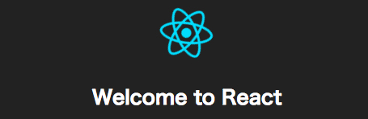
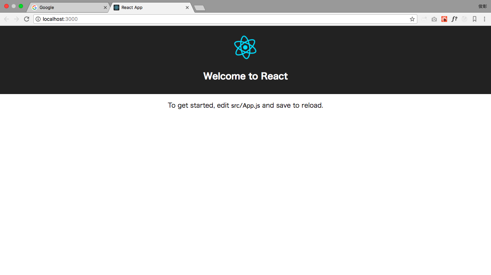
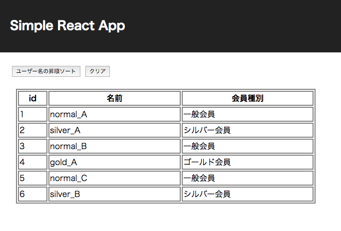
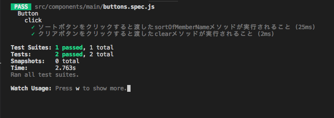

# React + Reduxで
# シンプルなWebアプリができるまで

----

# 目次

1. React.jsってなんだ
1. セットアップとHello World
1. ReactでWebページ作り
1. Reactの限界
1. Fluxの考え方とRedux
1. React + ReduxでWebページ作り
1. まとめ

----

# React.jsってなんだ

----

# React.jsってなんだ



公式サイト:
https://reactjs.org/

React.jsはUIのパーツ（構成部品）を作るためのJavascriptライブラリ
主にフロントエンドエンジニア向け

----

# React.jsってなんだ

## 特徴

以下が分かりやすい

https://html5experts.jp/hokaccha/13301/

要するに
- コンポネント指向を実現しやすくする
=> テストしやすい、ソースコード全体としての見通しが良くなる
- データが更新されると自動的に画面を再描画
- Virtual DOMという仕組みで差分だけの再描画を実現
- jsxという独自シンタックスを使う
=> babel等で変換が必要

これだけわかったらもう書いていこう（体育会系）

----

# セットアップとHello World

----

# セットアップとHello World

### Reactのセットアップには壁が多い

必要なこと
- node.jsの環境とnpm
=> nodistやnodebrewもあった方が良い
- babelなどを用いたトランスパイル
- webpackなどを用いたビルド（モジュール化）
- reactのインストール

必須ではないけどこれらもあった方が良い
- ESLint
- テスト用のフレームワーク
- 変更のウォッチなど細かい設定

## ここまでやってようやくスタートライン

----

# セットアップとHello World


----

# セットアップとHello World

## create-react-app

Reactを作ったfacebook製（要するに公式だ！）
Reactの環境構築をコマンド一発で出来るようにしてくれる神ツール

GitHub:
https://github.com/facebook/create-react-app

わかりやすい日本語解説（ありがたい）
https://qiita.com/chibicode/items/8533dd72f1ebaeb4b614

----

# セットアップとHello World

## create-react-appを使う

1. create-react-appを入れる
```
npm install -g create-react-app
```

2. hello worldしたいディレクトリでcreate-react-appを使う
```
create-react-app hello-world
```

以上

----

# セットアップとHello World


----

# セットアップとHello World

### できあがったページを確認する

1. create-react-appを実行したディレクトリ下にhello-worldディレクトリができているので移動
```
cd hello-world
```

2. アプリケーションを起動
```
// package.jsonに記載されているscript
npm start
```

3. http://localhost:3000 にアクセスする

----

# セットアップとHello World

かっちょいい


----

# セットアップとHello World

## Q. でも結局コイツ何使ってるかわからんの怖くない？
## A. package.jsonから辿れば良いでしょ

package.json
```
{
  "dependencies": {
    "react": "^16.2.0",
    "react-dom": "^16.2.0",
    "react-scripts": "1.1.1"
  }
}
```

----

# セットアップとHello World


----

# セットアップとHello World

### Q. 誰だお前(react-scripts)は！
### A. 情け無用の男! s(ry

色々隠してくれちゃってます。
依存モジュール以外に、スクリプト類も隠れています。

以下のコマンドで使っているものを全部見えるようになります。
（一度やったら元に戻せないので注意）
```
npm run eject
```

[私のGitHubコミットログで差分が見られます。](https://github.com/to4-yanagi/study_work/commit/b921a1be3665a31e146c526a7fbe102faccab14c)

遊びでReactを動かす分にはやらなくても良いけどプロジェクトで使ったりする場合には忘れずにやりましょう。
（隠れているものの細かい解説は時間の都合上割愛）

----

# ReactでWebページ作り

----

# ReactでWebページ作り

## 作るもの

会員情報の表示と並べ替えが出来るだけの簡単なWebページ

----

# ReactでWebページ作り

## 要件

### 会員情報表示

- 会員のid、名前、会員種別をテーブル形式で表示する

### アクション

- 「会員名の昇順でソート」ボタンを押すと会員の名前をASCIIコード順でソートする
- 「クリア」ボタンを押すとテーブルの並び順を初期状態に戻す

----

# ReactでWebページ作り

##  追加したモジュール

- prop-types
 → React.PropTypesでやろうとしたらESLintにイエローカード貰った

----

# ReactでWebページ作り

##  ディレクトリ構成

```
simple-react-app/
 ├ config/
 ├ public/
 ├ scripts/
 ├ src/
   ├ common/ //定数やfuncriosnなどを入れる（今回は定数のみ）
   ├ components/ //jsxで作成したコンポネント
     ├ main/ //ページが増えたりしたらここを増やす
       ├ index.jsx
       ├ buttons.jsx //ボタンのコンポネント
       ├ member-table.jsx //会員情報表示テーブルのコンポネント
   ├ data/ //データベース代わり、初期データが入っている
```

----

# ReactでWebページ作り

## src/index.jsx

スタート地点、public/index.htmlからid="root"を探して、Main画面（src/components/main/index.jsx）をレンダリングしている。

```
import React from 'react';
import ReactDOM from 'react-dom';
import Main from './components/main/index.jsx';
import registerServiceWorker from './registerServiceWorker';
import './index.css';

ReactDOM.render(<Main />, document.getElementById('root'));
registerServiceWorker();

```

----

# ReactでWebページ作り

## src/components/main/index.jsx（part1）

Reactのコンポネントは基本的にReact.Componentを継承したクラスとして定義
stateにはこのコンポネント内で使用する状態（たとえばデータ、検索条件、チェックの有無など）をまとめて持つ
ここでは、data/default-user-listにあるデータをstateの初期値として投入している

```
import React, { Component } from 'react'
import defaultUserData from '../../data/default-user-list'

export default class Main extends Component {
  state = {
    userDataList: defaultUserData
  }
（中略）
}

```

----

# ReactでWebページ作り

## src/components/main/index.jsx（part2）

stateが更新されるとrender()内にある要素が自動的に再描画される。
なお、複数のコンポネントはreturnできない（div要素などでwrapする）

```
  render = () => (
    <div>
      <header className="app-header">
        <h1 className="app-title">{appTitle}</h1>
      </header>
    （中略）
    </div>
  )

```

----

# ReactでWebページ作り

## src/components/main/index.jsx（part3）

子のコンポネントを呼び出す際に、プロパティを渡すことができる

以下の場合、src/components/main/member-table.jsxをレンダリングする際に、プロパティとしてこのコンポネントが持つstateであるuserDataListを渡している（part1で定義したアイツだ）

```
import MemberTable from './member-table'

<MemberTable
  userData={this.state.userDataList}
/>

```

----

# ReactでWebページ作り

## src/components/main/index.jsx（part4）

Buttonsには押された時にどう動くかを定義した関数(sortOfMemberNameとclear)を渡している

```
import Buttons from './buttons'

  <Buttons
    sortOfMemberName={() => this.setProperty(this.sortOfMemberName())}
    clear={() => this.setProperty(defaultUserData)}
  />

```

----

# ReactでWebページ作り

## src/components/main/index.jsx（part5）

stateの値を変更する場合は、this.setState()を使用する。
そうすることでrender()が再度呼ばれ、再描画が走る

```
  setProperty = data => this.setState({
    userDataList: data
  })
```

以下の例のように直接書き換えるのはNG
```
  setProperty = dataList => this.state.userDataList = data;
  setProperty = soloData => this.state.userDataList.push(soloData);
```

----

# ReactでWebページ作り

## src/components/main/member-table.jsx（part1）

親コンポネントから貰ったプロパティがある場合は、stateの代わりにpropを使用する。（勿論stateとの併用も可）

```
export default class UserTable extends Component {
  // 受け取るpropsの型を指定する。詳細は以下
  // https://qiita.com/koba04/items/bc13d1f42964278ae14e
  static propTypes = {
    userData: PropTypes.arrayOf(PropTypes.shape()).isRequired
  }
  // 何も受け取らなかった場合の値を指定
  static defaultProps = {
    userData: []
  }
 (中略)
}
```

----

# ReactでWebページ作り

## src/components/main/member-table.jsx（part2）

受け取ったpropsはthis.props.{key}で使用できる。

リスト形式のデータはarray.prototyoe.map()などで効率よく描写できる。以下の7行の記述でどれだけuserDataが増えてもtableBodyをすべて描写してくれる。

```
  renderUserData = () => this.props.userData.map(userData => (
    <tr key={userData.id}>
      <td className="id-column">{userData.id}</td>
      <td className="member-name-column">{userData.memberName}</td>
      <td className="member-kind-column">{userData.memberKind}</td>
    </tr>
  ))
```

----

# ReactでWebページ作り

## src/components/main/buttons.jsx

onClickにボタン押下時に行うアクションを指定する。
（今回は親(index.jsx)から貰ったsortOfMemberName()関数）

```
  <button
    onClick={this.props.sortOfMemberName}
    className="sort-button"
  >
    {buttonLabels.ascSort}
  </button>
```

----

# ReactでWebページ作り

その他にもなんやかんややって...

----

# ReactでWebページ作り

動いた！（ちゃっちい）



ソートもクリアもちゃんと動くのでまぁ充分よ

----

# ReactでWebページ作り

## 自動テストツール

アプリが動いたのでテストを書きます（順番が逆）
jestを使用する。こちらもfacebook製のテスティングフレームワークだ。

公式: https://facebook.github.io/jest/
GitHub: https://github.com/facebook/jest

なんとcreate-react-appには最初から組み込まれている（有能）

----

# ReactでWebページ作り

## 自動テストツール

package.json
```
"dependencies": {
  "jest": {
    "testMatch": [
      "<rootDir>/src/**/__tests__/**/*.{js,jsx,mjs}",
      "<rootDir>/src/**/?(*.)(spec|test).{js,jsx,mjs}"
    ],
  }
}
```
---

# ReactでWebページ作り

## 自動テストツール


例：テストしたいコンポネントがsrc/components/table/index.jsxである場合
以下のようなパスにテストコードを配置することで、テストを実行することができる（個人的には後者が好み）

<!-- __がうまく表示されなかったのでやむなく<p>タグを使用 -->

- <p>src/__tests__/table.js</p>
- <p>src/components/table/table.spac.js</p>

---

# ReactでWebページ作り

## src/components/main/buttons.spec.js（part1）

今回は試しにボタンのコンポネントをテストする
以下では、Buttonsコンポネントに渡すpropsを定義している。
srotOfMemberName,clearともに関数であるため、jestのMockFunctiosnを使用

```
describe('Button', () => {
  const props = {
    sortOfMemberName: jest.fn(),
    clear: jest.fn()
  }
```

---

# ReactでWebページ作り

## src/components/main/buttons.spec.js（part2）

以下は対象となるボタンのnodeを返す関数
本来はenzyme(https://github.com/airbnb/enzyme)等を使うとよりやりやすいらしいが、なるべくバニラに近い状態でやりたかったのでReact Test Utilities(https://reactjs.org/docs/test-utils.html)でやっている

```
  function setup(className) {
    const instance = TestUtils.renderIntoDocument(
      <Buttons {...props} />
    )
    return TestUtils.findRenderedDOMComponentWithClass(instance, className)
  }
```

---

# ReactでWebページ作り

## src/components/main/buttons.spec.js（part3）

テスト部分、ちゃんとsortOfMemberNameが呼び出されているかの確認

```
  it('ソートボタンをクリックすると渡したsortOfMemberNameメソッドが実行されること', () => {
      const buttonNode = setup('sort-button')

      TestUtils.Simulate.click(buttonNode)
      expect(props.sortOfMemberName).toBeCalled()
    })
```

---

# ReactでWebページ作り

## src/components/main/buttons.spec.js（part3）

テスト部分、ちゃんとclearが呼び出されているかの確認

```
  it('クリアボタンをクリックすると渡したclearメソッドが実行されること', () => {
      const buttonNode = setup('clear-button')

      TestUtils.Simulate.click(buttonNode)
      expect(props.clear).toBeCalled()
    })
```

---

# ReactでWebページ作り

## 実行結果

テスト成功が確認できる
これでソート機能に問題が起きた時に、少なくともstateの受け渡しの部分には問題が無いことが担保できる。



---

# Reactの限界

---

# Reactの限界

一見便利なように見えるReactだが、実際にプロジェクトで利用しようとすると、以下のような問題があることにすぐに気付くはずだ

1. 子から親へのstateの受け渡しが不可能
1. コンポネントのネストが深くなった時にstateを受け渡す回数も増えて行く

どちらもホワイトボードで説明する（ダイナミック手抜き）

---

# fluxの考え方とRedux

---
