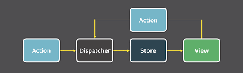

# React + Reduxで
# シンプルなWebアプリができるまで

----

# 目次

1. React.jsってなんだ
1. セットアップとHello World
1. ReactでWebページ作り
1. Reactの限界
1. Fluxの考え方とRedux
1. React + ReduxでWebページ作り
1. まとめ

----

# React.jsってなんだ

----

# React.jsってなんだ


公式サイト:
https://reactjs.org/

React.jsはUIのパーツ（構成部品）を作るためのJavascriptライブラリ
主にフロントエンドエンジニア向け

----

# React.jsってなんだ

## 特徴

以下が分かりやすい

https://html5experts.jp/hokaccha/13301/

要するに
- コンポネント指向を実現しやすくする
=> テストしやすい、ソースコード全体としての見通しが良くなる
- データが更新されると自動的に画面を再描画
- Virtual DOMという仕組みで差分だけの再描画を実現
- jsxという独自シンタックスを使う
=> babel等で変換が必要
- DOM操作にさよならバイバイ

これだけわかったらもう書いていこう（体育会系）

----

# セットアップとHello World

----

# セットアップとHello World

### Reactのセットアップには壁が多い

必要なこと
- node.jsの環境とnpm
=> nodistやnodebrewもあった方が良い
- babelなどを用いたトランスパイル
- webpackなどを用いたビルド（モジュール化）
- reactのインストール

必須ではないけどこれらもあった方が良い
- ESLint
- テスト用のフレームワーク
- 変更のウォッチなど細かい設定

## ここまでやってようやくスタートライン

----

# セットアップとHello World


----

# セットアップとHello World

## create-react-app

Reactを作ったfacebook製（要するに公式だ！）
Reactの環境構築をコマンド一発で出来るようにしてくれる神ツール

GitHub:
https://github.com/facebook/create-react-app

わかりやすい日本語解説（ありがたい）
https://qiita.com/chibicode/items/8533dd72f1ebaeb4b614

----

# セットアップとHello World

## create-react-appを使う

1. create-react-appを入れる
```
npm install -g create-react-app
```

2. hello worldしたいディレクトリでcreate-react-appを使う
```
create-react-app hello-world
```

以上

----

# セットアップとHello World


----

# セットアップとHello World

### できあがったページを確認する

1. create-react-appを実行したディレクトリ下にhello-worldディレクトリができているので移動
```
cd hello-world
```

2. アプリケーションを起動
```
// package.jsonに記載されているscript
npm start
```

3. http://localhost:3000 にアクセスする

----

# セットアップとHello World

かっちょいい


----

# セットアップとHello World

## Q. でも結局コイツ何使ってるかわからんの怖くない？
## A. package.jsonから辿れば良いでしょ

package.json
```
{
  "dependencies": {
    "react": "^16.2.0",
    "react-dom": "^16.2.0",
    "react-scripts": "1.1.1"
  }
}
```

----

# セットアップとHello World


----

# セットアップとHello World

### Q. 誰だお前(react-scripts)は！
### A. 情け無用の男! s(ry

色々隠してくれちゃってます。
依存モジュール以外に、スクリプト類も隠れています。

以下のコマンドで使っているものを全部見えるようになります。
（一度やったら元に戻せないので注意）
```
npm run eject
```

[私のGitHubコミットログで差分が見られます。](https://github.com/to4-yanagi/study_work/commit/b921a1be3665a31e146c526a7fbe102faccab14c)

遊びでReactを動かす分にはやらなくても良いけどプロジェクトで使ったりする場合には忘れずにやりましょう。
（隠れているものの細かい解説は時間の都合上割愛）

----

# ReactでWebページ作り

----

# ReactでWebページ作り

## 作るもの

会員情報の表示と並べ替えが出来るだけの簡単なWebページ

----

# ReactでWebページ作り

## 要件

### 会員情報表示

- 会員のid、名前、会員種別をテーブル形式で表示する

### アクション

- 「会員名の昇順でソート」ボタンを押すと会員の名前をASCIIコード順でソートする
- 「クリア」ボタンを押すとテーブルの並び順を初期状態に戻す

### その他

- サーバー側は今回は作らない

----

# ReactでWebページ作り

##  追加したモジュール

- prop-types
=> propを受け取る場合に、その型を指定するために使用
=> React.PropTypesでやろうとしたらESLintにイエローカード貰った

```
npm i --save prop-types
```

----

# ReactでWebページ作り

##  ディレクトリ構成

```
simple-react-app/
 ├ config/
 ├ public/
 ├ scripts/
 ├ src/
   ├ common/ //定数やfuncriosnなどを入れる（今回は定数のみ）
   ├ components/ //jsxで作成したコンポネント
     ├ main/ //ページが増えたりしたらここを増やす
       ├ index.jsx
       ├ buttons.jsx //ボタンのコンポネント
       ├ member-table.jsx //会員情報表示テーブルのコンポネント
   ├ data/ //データベース代わり、初期データが入っている
```

----

# ReactでWebページ作り

## src/index.jsx

スタート地点、public/index.htmlからid="root"を探して、Main画面（src/components/main/index.jsx）をレンダリングしている。

```
import React from 'react';
import ReactDOM from 'react-dom';
import Main from './components/main/index.jsx';
import registerServiceWorker from './registerServiceWorker';
import './index.css';

ReactDOM.render(<Main />, document.getElementById('root'));
registerServiceWorker();

```

----

# ReactでWebページ作り

## src/components/main/index.jsx（part1）

Reactのコンポネントは基本的にReact.Componentを継承したクラスとして定義
stateにはこのコンポネント内で使用する状態（たとえばデータ、検索条件、チェックの有無など）をまとめて持つ
ここでは、data/default-user-listにあるデータをstateの初期値として投入している

```
import React, { Component } from 'react'
import defaultUserData from '../../data/default-user-list'

export default class Main extends Component {
  state = {
    userDataList: defaultUserData
  }
（中略）
}

```

----

# ReactでWebページ作り

## src/components/main/index.jsx（part2）

stateが更新されるとrender()内にある要素が自動的に再描画される。
なお、複数のコンポネントはreturnできない（div要素などでwrapする）

```
  render = () => (
    <div>
      <header className="app-header">
        <h1 className="app-title">{appTitle}</h1>
      </header>
    （中略）
    </div>
  )

```

----

# ReactでWebページ作り

## src/components/main/index.jsx（part3）

子のコンポネントを呼び出す際に、プロパティを渡すことができる

以下の場合、src/components/main/member-table.jsxをレンダリングする際に、プロパティとしてこのコンポネントが持つstateであるuserDataListを渡している（part1で定義したアイツだ）

```
import MemberTable from './member-table'

<MemberTable
  userData={this.state.userDataList}
/>

```

----

# ReactでWebページ作り

## src/components/main/index.jsx（part4）

Buttonsには押された時にどう動くかを定義した関数(sortOfMemberNameとclear)を渡している

```
import Buttons from './buttons'

  <Buttons
    sortOfMemberName={() => this.setProperty(this.sortOfMemberName())}
    clear={() => this.setProperty(defaultUserData)}
  />

```

----

# ReactでWebページ作り

## src/components/main/index.jsx（part5）

stateの値を変更する場合は、this.setState()を使用する。
そうすることでrender()が再度呼ばれ、再描画が走る

```
  setProperty = data => this.setState({
    userDataList: data
  })
```

以下の例のように直接書き換えるのはNG
```
  setProperty = dataList => this.state.userDataList = data;
  setProperty = soloData => this.state.userDataList.push(soloData);
```

----

# ReactでWebページ作り

## src/components/main/member-table.jsx（part1）

親コンポネントから貰ったプロパティがある場合は、stateの代わりにpropを使用する。（勿論stateとの併用も可）

```
export default class UserTable extends Component {
  // 受け取るpropsの型を指定する。詳細は以下
  // https://qiita.com/koba04/items/bc13d1f42964278ae14e
  static propTypes = {
    userData: PropTypes.arrayOf(PropTypes.shape()).isRequired
  }
  // 何も受け取らなかった場合の値を指定
  static defaultProps = {
    userData: []
  }
 (中略)
}
```

----

# ReactでWebページ作り

## src/components/main/member-table.jsx（part2）

受け取ったpropsはthis.props.{key}で使用できる。

リスト形式のデータはarray.prototyoe.map()などで効率よく描写できる。以下の7行の記述でどれだけuserDataが増えてもtableBodyをすべて描写してくれる。

```
  renderUserData = () => this.props.userData.map(userData => (
    <tr key={userData.id}>
      <td className="id-column">{userData.id}</td>
      <td className="member-name-column">{userData.memberName}</td>
      <td className="member-kind-column">{userData.memberKind}</td>
    </tr>
  ))
```

----

# ReactでWebページ作り

## src/components/main/buttons.jsx

onClickにボタン押下時に行うアクションを指定する。
（今回は親(index.jsx)から貰ったsortOfMemberName()関数）

```
  <button
    onClick={this.props.sortOfMemberName}
    className="sort-button"
  >
    {buttonLabels.ascSort}
  </button>
```

----

# ReactでWebページ作り

その他にもなんやかんややって...

----

# ReactでWebページ作り

動いた！（ちゃっちい）


ソートもクリアもちゃんと動くのでまぁ充分よ

----

# ReactでWebページ作り

## 自動テストツール

アプリが動いたのでテストを書きます（順番が逆）
jestを使用する。こちらもfacebook製のテスティングフレームワークだ。

公式: https://facebook.github.io/jest/
GitHub: https://github.com/facebook/jest

なんとcreate-react-appには最初から組み込まれている（有能）

----

# ReactでWebページ作り

## 自動テストツール

package.json
```
"dependencies": {
  "jest": {
    "testMatch": [
      "<rootDir>/src/**/__tests__/**/*.{js,jsx,mjs}",
      "<rootDir>/src/**/?(*.)(spec|test).{js,jsx,mjs}"
    ],
  }
}
```
---

# ReactでWebページ作り

## 自動テストツール


例：テストしたいコンポネントがsrc/components/table/index.jsxである場合
以下のようなパスにテストコードを配置することで、テストを実行することができる（個人的には後者が好み）

<!-- __がうまく表示されなかったのでやむなく<p>タグを使用 -->

- <p>src/__tests__/table.js</p>
- <p>src/components/table/table.spec.js</p>

---

# ReactでWebページ作り

## src/components/main/buttons.spec.js（part1）

今回は試しにボタンのコンポネントをテストする
以下では、Buttonsコンポネントに渡すpropsを定義している。
srotOfMemberName,clearともに関数であるため、jestのMockFunctiosnを使用

```
describe('Button', () => {
  const props = {
    sortOfMemberName: jest.fn(),
    clear: jest.fn()
  }
```

---

# ReactでWebページ作り

## src/components/main/buttons.spec.js（part2）

以下は対象となるボタンのnodeを返す関数
本来はenzyme(https://github.com/airbnb/enzyme)等を使うとよりやりやすいらしいが、なるべくバニラに近い状態でやりたかったのでReact Test Utilities(https://reactjs.org/docs/test-utils.html)でやっている

```
  function setup(className) {
    const instance = TestUtils.renderIntoDocument(
      <Buttons {...props} />
    )
    return TestUtils.findRenderedDOMComponentWithClass(instance, className)
  }
```

---

# ReactでWebページ作り

## src/components/main/buttons.spec.js（part3）

テスト部分、ちゃんとsortOfMemberNameが呼び出されているかの確認

```
  it('ソートボタンをクリックすると渡したsortOfMemberNameメソッドが実行されること', () => {
      const buttonNode = setup('sort-button')

      TestUtils.Simulate.click(buttonNode)
      expect(props.sortOfMemberName).toBeCalled()
    })
```

---

# ReactでWebページ作り

## src/components/main/buttons.spec.js（part3）

テスト部分、ちゃんとclearが呼び出されているかの確認

```
  it('クリアボタンをクリックすると渡したclearメソッドが実行されること', () => {
      const buttonNode = setup('clear-button')

      TestUtils.Simulate.click(buttonNode)
      expect(props.clear).toBeCalled()
    })
```

---

# ReactでWebページ作り

## 実行結果

テスト成功が確認できる
これでソート機能に問題が起きた時に、少なくともstateの受け渡しの部分には問題が無いことが担保できる。


---

# Reactの限界

---

# Reactの限界

一見便利なように見えるReactだが、実際にプロジェクトで利用しようとすると、以下のような問題があることにすぐに気付くはずだ

1. 子から親へのstateの受け渡しが不可能
1. コンポネントのネストが深くなった時にstateを受け渡す回数も増えて行く

どちらもホワイトボードで説明する（ダイナミック手抜き）

---

# Reactの限界

## まとめ

- Reactはあくまでコンポネント(MVCで言うとV部分)の実装、管理に特化したフレームワーク
- 巨大なWebシステム作り、データの流れの制御などをしっかり設計せずに行おうとするとかえって煩雑化し、「これならjQueryの方が良かった」という状況を生む
- 全然違うじゃん！すっごいフレームワークあるからって私プロジェクトメンバーに言ったのに、Reactを使えばすべてよくなるんだよって。私バカみたいじゃん！

---

# Reactの限界

## 「もういいよ！私Reactやめる！」


---

# fluxの考え方とRedux

---

# fluxの考え方とRedux

## fluxとは

facebookが提唱した、reactなどのUIを持つアプリケーションを実装する際に用いるデザインパターン(MVCみたいなあれ)の一種

公式のDocs:
http://facebook.github.io/flux/docs/overview.html#content
参考:
https://qiita.com/sl2/items/ff7a07c00f545d245a5c
https://app.codegrid.net/entry/react-ex-1
https://qiita.com/knhr__/items/5fec7571dab80e2dcd92

----

# fluxの考え方とRedux

## fluxとは

facebookは以下の図を用いてfluxについて説明する
（詳細は参考ページを見ていきながら解説する）



---

# fluxの考え方とRedux

## fluxの特徴

- データの流れが一方向で簡潔
- データの管理が一箇所(store)で行われることによりコンポネントがネストしていたり、データフローが複雑であってもソースが複雑になるのを防ぎやすい
- 表示（view）とデータ（store）が疎結合

---

# fluxの考え方とRedux

## fluxを実装するフレームワーク

「flux フレームワーク」というワードでググると「flux戦争」なんて言葉が出てくるぐらい、fluxを実現するための手段を様々な人（組織）が公開しています。

代表的なもの
- facebook/flux: https://github.com/facebook/flux
- Redux: https://github.com/reactjs/redux
- fluxxor: https://github.com/BinaryMuse/fluxxor
- fluxible: https://github.com/yahoo/fluxible

ここ最近、ようやくReduxが頭一つ抜けてきた感があります。

---

# fluxの考え方とRedux

## Reduxとは

先述のfluxを実現するためのフレームワーク、以下の3原則に基づく

1. Single source of truth
=> stateは一つのstoreの中に保存されること、シングルトンパターン（https://ja.wikipedia.org/wiki/Singleton_%E3%83%91%E3%82%BF%E3%83%BC%E3%83%B3）
2. State is read-only
=> stateを直接変更することはできない、変更する唯一の方法はactionのemit
3. Changes are made with pure functions
=> Reducer（stateがどのように変化するかを指定する）は純粋関数である

これらもソースを見て理解していこう

---

# React + ReduxでWebページ作り

----

# React + ReduxでWebページ作り

## 要件

- ReactでWebページ作り、の項で作ったものをReduxを導入して書き換える

----

# React + ReduxでWebページ作り

##  追加したモジュール

- redux
=> reduxの基本機能(createStoreなど)を提供するモジュール

- react-redux
=> resctとreduxを結ぶモジュール

```
npm i --save redux react-redux
```

----

# React + ReduxでWebページ作り

##  ディレクトリ構成

```
react-redux-app/
 ├ config/
 ├ public/
 ├ scripts/
 ├ src/
   ├ actions/ //イベントに応じて発火するアクションを入れる
   ├ common/
   ├ components/ //jsxで作成したコンポネント
     ├ main/ //ページが増えたりしたらここを増やす
   ├ containers/ //reactとreduxを結ぶ働きをする
     ├ main/ //ページが増えたりしたらここを増やす
   ├ reducers/ //actionとstateから新しいstoreを作成する
   ├ data/
```

----

# React + ReduxでWebページ作り

## storeを作る

src/index.jsにて、以下のように、createStoreでstoreを作成し、Providerに渡す

```
import { createStore } from 'redux';
import { Provider } from 'react-redux';
import rootReducer from './rootReducer';
import Main from './containers/main/main';

const Store = createStore(rootReducer)

ReactDOM.render(
  <Provider store={Store}>
    <Main />
  </Provider>,
  document.getElementById('root')
);
registerServiceWorker();

```

----

# React + ReduxでWebページ作り

## reducerを作る（part1）

storeの中身は今回はsrc/rootReducer下で定義
reducerは分割できるので、reducersというフォルダの下に使う分を定義していく

```
import { combineReducers } from 'redux';
import member from './reducers/member';

export default combineReducers({
  member, //reducerが増えたらここに追加していく
});

```

----

# React + ReduxでWebページ作り

## reducerを作る（part2）

reducerの役割はシンプルで、既存のstateとアクションから渡ってきた値を合体させて新しいstateとして返す。
src/reducers/member.js

```
const initialState = {
  memberList: []
};
export default (state = initialState, action) => {
  switch (action.type) {
    case 'PUT_MEMBER_LIST':
      return {
        ...state, 
        memberList: action.memberList
      };
    default:
      return state;
  }
}
```

----

# React + ReduxでWebページ作り

## ActionとActionCreaterを作る

今回は一緒くたになっている、本来、'PUT_MEMBER_LIST'の部分は定数化するべき（typeは他のactionと被ってはいけないため）
src/actions/member

```
export const putMemberList = memberList => {
  return {
    type: 'PUT_MEMBER_LIST',
    memberList
  }
}
```

----

# React + ReduxでWebページ作り

## Containerを作る（part1）

mapStateToPropsではstateをフィルタリングする

src/containers/buttons.js

```
function mapStateToProps(state) {
  return {
    memberList: state.member.memberList
  };
}
```

----

# React + ReduxでWebページ作り

## Containerを作る（part2）

mapDispatchToPropsでは変更を伝えるアクションを作成する
dispatch()を忘れると変更がreducerまで伝わらないので注意

src/containers/buttons.js

```
function mapDispatchToProps(dispatch) {
  return {
    putMemberList: (memberList) => {
      dispatch(putMemberList(memberList));
    },
  };
}
```

----

# React + ReduxでWebページ作り

## Containerを作る（part3）

reduxの世界(mapStateToProps, mapDispatchToProps)とreactの世界(components/main/buttons.jsx)の結合

src/containers/buttons.js

```
import { connect } from 'react-redux';
import { putMemberList } from '../../actions/member';
import Buttons from '../../components/main/buttons.jsx';

export default connect(
  mapStateToProps,
  mapDispatchToProps
)(Buttons);
```

----

# React + ReduxでWebページ作り

## 呼び方（part1）

Componentsじゃなくてcontainerを呼び出す（reduxの世界と繋がっているから）

src/conponents/index.jsx

```
import Buttons from '../../containers/main/buttons'

  render = () => (
    <div>
      <header className="app-header">
        <h1 className="app-title">{appTitle}</h1>
      </header>
      <Buttons />
      <MemberTable />
    </div>
  )
```

----

# React + ReduxでWebページ作り

## 呼び方（part2）

PropsTypes等を定義するのはReact同様

src/conponents/buttons.jsx

```
  static propTypes = {
    memberList: PropTypes.arrayOf(PropTypes.shape()).isRequired,
    putMemberList: PropTypes.func.isRequired
  }
  static defaultProps = {
    memberList: [],
    putMemberList: () => { }
  }
```

----

# React + ReduxでWebページ作り

## 呼び方（part3）

使う際も特に意識することはない（mapDispatchToPropsでdispatch呼んでるからね）

src/conponents/buttons.jsx

```
  <button
    onClick={() => this.props.putMemberList(defaultUserData)}
    className="clear-button"
  >
    {buttonLabels.clear}
  </button>
```

----

# React + ReduxでWebページ作り

## reducerテスト

reducerはpureな関数なのでとてもテストしやすい

src/reducers/member.spec.js
```
describe('members reducer', () => {
  it('何も渡さない場合にinitialStateを返すこと', () => {
    expect(member(undefined, {})).toEqual(
      {
        memberList: []
      }
    )
  }),
})
```
----

# React + ReduxでWebページ作り

## actionテスト


src/actions/member.spec.js
```
import { putMemberList } from './member';
 
describe('actions', () => {
  it('PUT_MEMBRER_LISTアクションを生成すること', () => {
    const expectedAction = {
      type: 'PUT_MEMBER_LIST',
      memberList
    }
    expect(putMemberList(memberList)).toEqual(expectedAction)
  })
})
```
----

# まとめ

----

# まとめ

- Reactを使うことで、スケールしやすく、テストしやすいコンポネント単位での開発を容易にする
- データの制御についてはそれを補う考え方やフレームワークがあった方が良い（今回で言えばfluxやRedux）
- Reduxにも弱点はある（非同期の制御が弱い、ソースが冗長化するなど）がそれを補うモジュール（redux-sagaやredux-thunk、redux-actionsなど）があるので、それらを上手く活用すると更に隙がなくなる。

----

# ご清聴ありがとうございました

----
